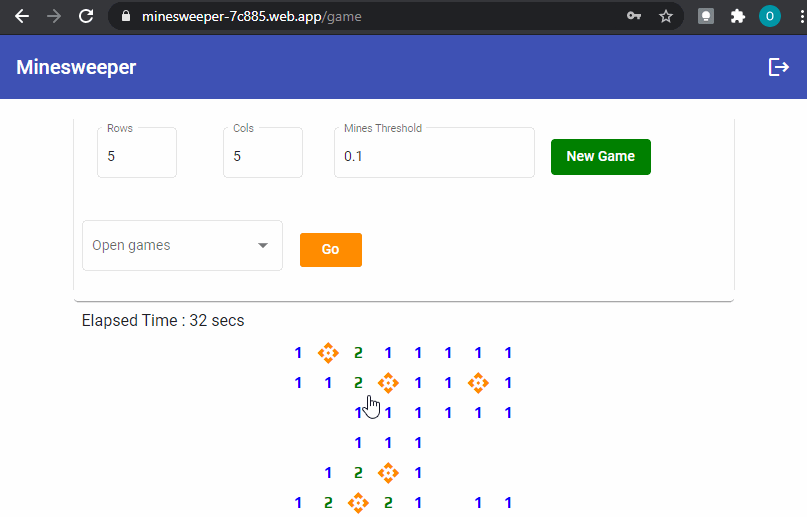
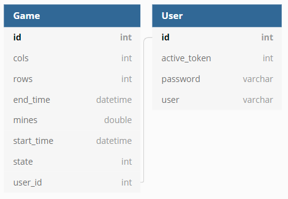

# Minesweeper API

Running online at https://minesweeper-7c885.web.app/

# DEMO


# Build and testing
## Backend
### build
```
minesweerper-API $ ./gradlew build
```

### run
```
minesweerper-API $ ./gradlew bootRun
```

### test
```
minesweerper-API $ ./gradlew test
```

## Frontend
### build
```
minesweerper-API/minesweeper-frontend $ ./ng build
```

### run (will run on )
```
minesweerper-API/minesweeper-frontend $ ./ng serve
```

# API

## Swagger
- Open https://minesweeper-7c885.herokuapp.com/swagger-ui.html to see all controllers and endpoints available

## Create a new game
```
$ curl -X POST "https://minesweeper-7c885.herokuapp.com/users/signup" -H "accept: */*" -H "Content-Type: application/json" -d "{ \"user\": \"osvalr\", \"password\": \"mypass\"}"
```

## Game Details
```
$ curl -X GET "https://minesweeper-7c885.herokuapp.com/games/1/details" -H "accept: */*"
```

## Open position
```
$ curl -X POST "https://minesweeper-7c885.herokuapp.com/games/1/positions" -H "accept: */*" -H "Content-Type: application/json" -d "{ \"x\": 1, \"y\": 1}"
```

## Flag position
```
$ curl -X POST "https://minesweeper-7c885.herokuapp.com/games/1/flags" -H "accept: */*" -H "Content-Type: application/json" -d "{ \"x\": 1, \"y\": 1}"
```

**Stack used**
- Database: H2 (In-memory DB, console enabled in /h2)
- API served with a springboot app
- Angular v8 app for API Client Library
- Angular Material, boostrap v4, Google Fonts (Play) for hints numbers
- Swagger available for documentation

**Platforms**
- Firebase Hosting for frontend
- Herokuapp for backend as gradle project

**Unit tests**
- No unit tests for frontend app
- One test case included for mine field creation where it's validated that adjacent cells are initialized properly


# ERD


